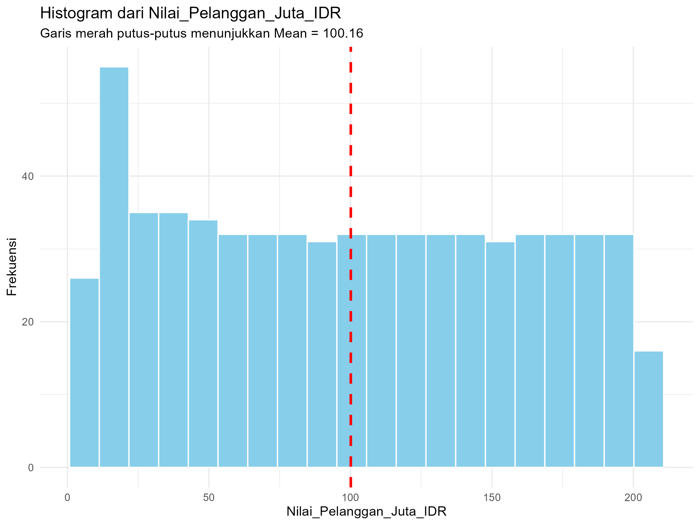
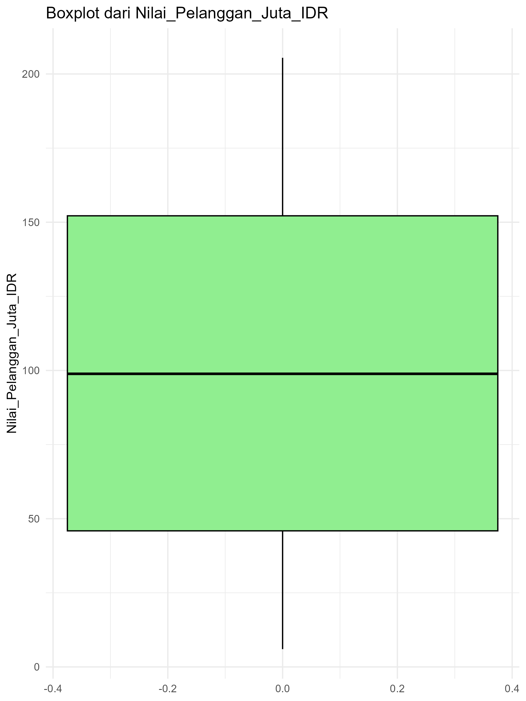
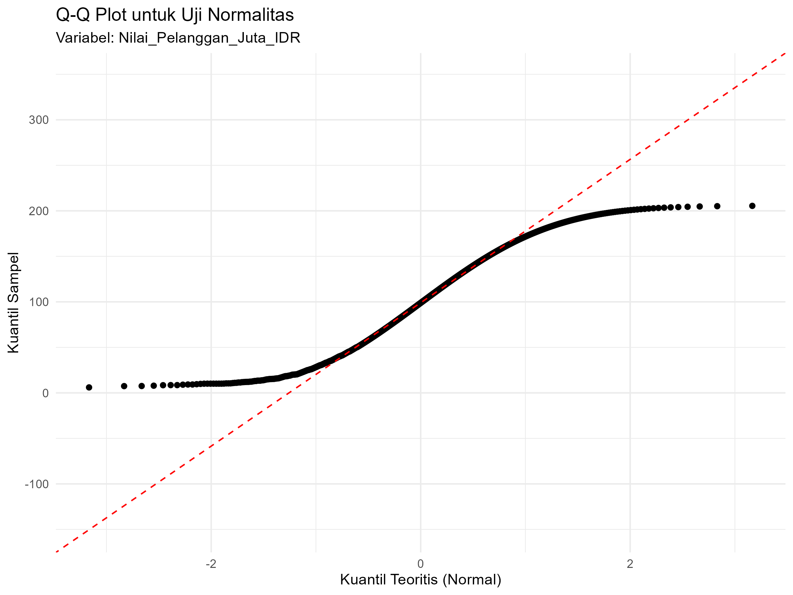
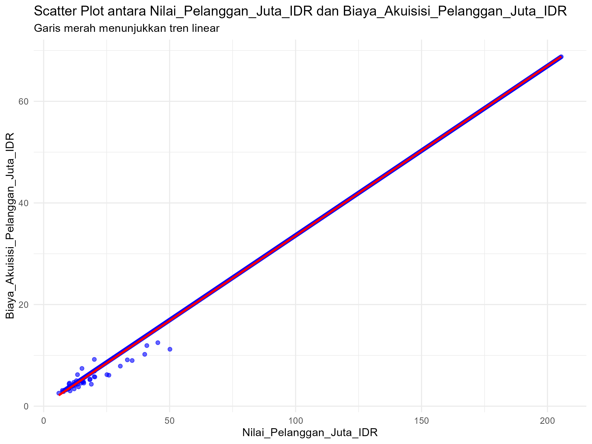
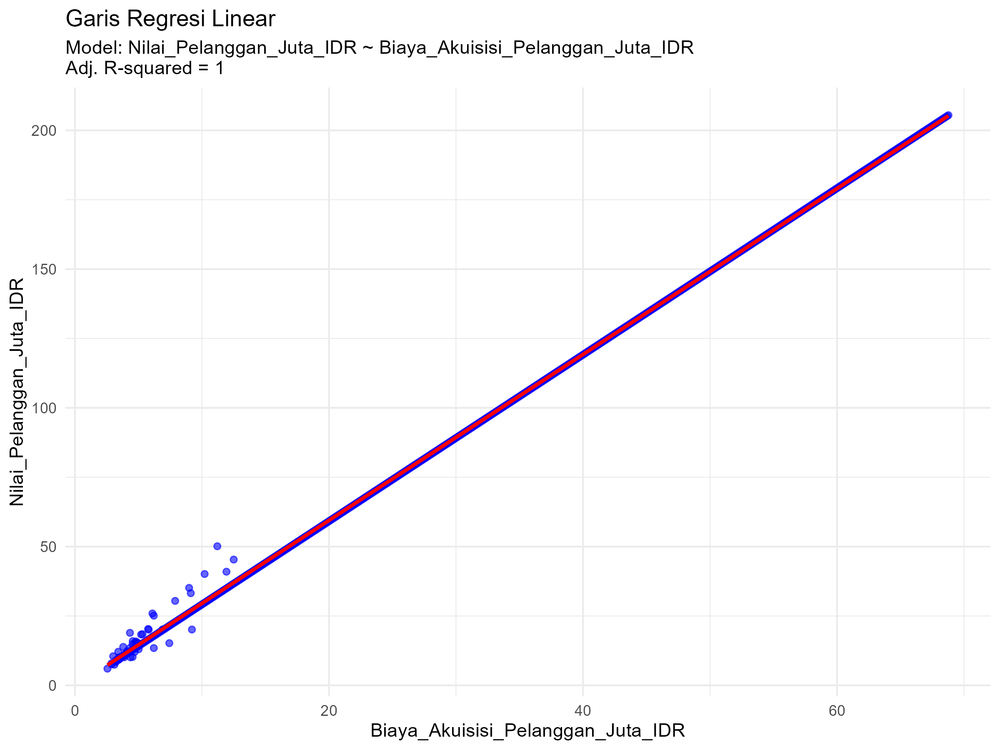

# Tugas Analisis Statistik: Deskriptif, Korelasi, dan Regresi

## 1. Informasi Penyusun

- **Nama:** `[I KOMANG YUSA KATMANDU]`
- **NIM:** `[2515091096]`
- **Program Studi:** `[SISTEM INFORMASI]`
- **Mata Kuliah:** Statistika dan Probabilitas

---

## 2. Deskripsi Proyek

Dataset yang digunakan dalam proyek ini adalah data startup SaaS yang disimpan dalam file data_startup_saas.csv. Dataset ini berisi data numerik yang menggambarkan performa pelanggan, khususnya Nilai_Pelanggan_Juta_IDR dan Biaya_Akuisisi_Pelanggan_Juta_IDR. Variabel Nilai_Pelanggan_Juta_IDR digunakan sebagai variabel utama (variabel A) yang merepresentasikan nilai ekonomi pelanggan bagi perusahaan, sedangkan Biaya_Akuisisi_Pelanggan_Juta_IDR digunakan sebagai variabel pembanding (variabel B) yang menunjukkan biaya yang dikeluarkan untuk memperoleh pelanggan. Tujuan dari analisis ini adalah untuk memahami karakteristik data melalui statistik deskriptif, menguji asumsi normalitas data, menganalisis hubungan antara nilai pelanggan dan biaya akuisisi pelanggan menggunakan analisis korelasi, serta memodelkan hubungan tersebut melalui analisis regresi sederhana.

---

## 3. Struktur Proyek

Proyek ini diorganisir ke dalam beberapa folder:
- `/data`: Berisi dataset mentah yang digunakan untuk analisis.
- `/scripts`: Berisi semua skrip R yang digunakan dalam analisis, diurutkan berdasarkan alur kerja.
- `/results`: Berisi output dari analisis, seperti plot, gambar, atau tabel ringkasan.

---

## 4. Cara Menjalankan Analisis

Untuk mereproduksi hasil analisis ini, ikuti langkah-langkah berikut ya:
1. Pastikan Anda memiliki R dan RStudio terinstal.
2. Buka proyek R ini di RStudio.
3. Instal paket yang diperlukan dengan menjalankan perintah berikut di konsol R:
   ```R
   # install.packages("tidyverse") dan library(tidyverse)
   ```
4. Jalankan skrip di dalam folder `/scripts` secara berurutan yang dimulai dari 01_Preparasi_data.R hingga 05_Analisis_Regresi.R

---

## 5. Hasil dan Interpretasi

Di bagian ini, mahasiswa diharapkan untuk menyajikan dan menginterpretasikan hasil dari setiap tahap analisis.

### 5.1. Statistik Deskriptif
- **Ukuran Pemusatan (Mean, Median, Modus):**
- Mean (Rata-rata): 100.16
- Median (Tengah): 98.87
- Modus (Nilai yang paling sering muncul): 10.11
Jadi, rata-rata nilai pelanggan sekitar 100, nilai tengahnya 98.87, sedangkan nilai yang paling sering muncul adalah 10.11.
Mean, median, dan modus adalah tiga ukuran pemusatan data yang sering digunakan dalam statistik untuk memahami karakteristik suatu kumpulan angka. Mean atau rata-rata dihitung dengan menjumlahkan seluruh nilai kemudian membaginya dengan jumlah data memberikan gambaran umum tentang nilai tipikal dalam kumpulan tersebut. Median adalah nilai tengah dari data yang sudah diurutkan jika jumlah data ganjil, median adalah angka di posisi tengah, sedangkan jika genap, median adalah rata-rata dari dua angka di tengah.  Sementara itu, modus adalah nilai yang paling sering muncul dalam kumpulan data sehingga menunjukkan angka yang paling dominan atau populer. 

- **Ukuran Sebaran (Standar Deviasi, Range, Kuartil):**
Ringkasan
  Nilai ukuran sebaran dari data Nilai_Pelanggan_Juta_IDR adalah sebagai berikut:
- Standar Deviasi: 59.81 
- Range (Jangkauan): 6.01 – 205.46 
- Kuartil 1 (Q1): 45.91
- Median (Q2): 98.87
- Kuartil 3 (Q3): 152.16
Interpretasi
- Ukuran sebaran dari data Nilai_Pelanggan_Juta_IDR menunjukkan bahwa distribusi nilai pelanggan cukup bervariasi. Standar deviasi sebesar 59.81 menandakan adanya perbedaan yang tinggi antara nilai pelanggan dengan rata-rata, sehingga data tidak terkonsentrasi pada satu titik dan menyebar luas. Rentang nilai antara 6.01 hingga 205.46 memperlihatkan adanya jarak yang besar antara pelanggan dengan nilai terendah dan tertinggi. Jika dilihat dari ringkasan lima angka, nilai minimum berada di 6.01, kuartil pertama di 45.91, mediannya ada di 98.87, kuartil ketiga ada di 152.16, dan maksimum di 205.46. Hal ini berarti sekitar 25% pelanggan memiliki nilai di bawah 45.91 juta IDR, setengah dari total pelanggan berada di bawah 98.87 juta IDR, dan 75% berada di bawah 152.16 juta IDR. mayoritas pelanggan berada di kisaran 45–150 juta IDR, namun terdapat sebagian kecil pelanggan dengan nilai sangat tinggi yang membuat distribusi data lebih lebar dan sedikit condong ke arah atas. Keseluruhan interpretasi ini menunjukkan bahwa data pelanggan SaaS memiliki tingkat penyebaran yang besar dengan variasi signifikan antar kelompok

- **Visualisasi (Histogram/Boxplot):**
  - *Visualisasi Histogram*
  
   - *Visualisasi Boxplot*
  
  - Interpretasi
  - Histogram Nilai_Pelanggan_Juta_IDR memperlihatkan distribusi nilai pelanggan dalam jutaan rupiah. Sebagian besar data terkonsentrasi pada kisaran menengah, dengan frekuensi yang cukup tinggi di sekitar nilai 50 hingga 150 juta IDR. Garis merah putus-putus yang ditampilkan pada posisi 100.16 menunjukkan nilai rata-rata (mean) dari data. Terlihat bahwa distribusi data cukup menyebar, dengan adanya pelanggan bernilai rendah sekitar 6 juta IDR hingga pelanggan bernilai sangat tinggi mencapai lebih dari 200 juta IDR. Posisi mean yang sedikit lebih tinggi dibanding median (98.87) menandakan adanya beberapa nilai ekstrem di sisi atas yang menarik rata-rata ke arah kanan, sehingga distribusi cenderung condong ke kanan. histogram ini menggambarkan bahwa mayoritas pelanggan SaaS berada di kisaran menengah dan terdapat sebagian kecil pelanggan dengan nilai sangat tinggi yang memperlebar sebaran data.
  
  ### 5.2. Uji Normalitas
- **Hasil Uji Shapiro-Wilk:**
  - *p-value* = 7.607e-13
  - *Interpretasi:* Apakah data Anda terdistribusi normal berdasarkan hasil uji? Apa implikasinya?
  - Hasil uji normalitas Shapiro-Wilk menunjukkan nilai p-value sebesar 7.607e-13 yang jauh lebih kecil dari batas signifikansi 0,05, sehingga dapat disimpulkan bahwa data tidak terdistribusi normal. Implikasinya, analisis statistik yang mengasumsikan distribusi normal seperti uji t atau ANOVA tidak tepat digunakan, dan sebaiknya diganti dengan metode non-parametrik yang lebih sesuai. Selain itu, penyimpangan dari normalitas ini mengindikasikan adanya pola distribusi yang miring atau outlier dalam data, misalnya sebagian kecil pelanggan dengan nilai transaksi sangat tinggi yang memengaruhi bentuk distribusi keseluruhan.
  
- **Plot Q-Q:**
  - 
  - *Interpretasi:* Apakah titik-titik data mengikuti garis lurus? Apa artinya?
  - Pada Q-Q plot, titik-titik data tidak mengikuti garis lurus merah secara konsisten, melainkan terlihat menyimpang dari garis referensi. Artinya, distribusi data berbeda dari distribusi normal yang seharusnya ditunjukkan oleh titik-titik yang sejajar dengan garis lurus. Penyimpangan ini menegaskan hasil uji Shapiro-Wilk bahwa data tidak terdistribusi normal, sehingga asumsi normalitas tidak terpenuhi dan analisis parametrik yang bergantung pada distribusi normal sebaiknya diganti dengan metode non-parametrik.

  ### 5.3. Analisis Korelasi
- **Nilai Koefisien Korelasi:**
  - *Nilai r* = 0.999627.
  - *Interpretasi:* Seberapa kuat dan apa arah hubungan antara dua variabel yang Anda uji? (misalnya, korelasi positif kuat, negatif lemah, atau tidak ada korelasi).
  - Hasil uji korelasi Spearman menunjukkan nilai koefisien korelasi (ρ) sebesar 0.999627, yang berarti hubungan antara variabel Nilai_Pelanggan_Juta_IDR dan Biaya_Akuisisi_Pelanggan_Juta_IDR adalah sangat kuat dan berarah positif. Dengan kata lain, ketika nilai pelanggan meningkat, biaya akuisisi pelanggan juga cenderung meningkat secara hampir linier sempurna.
- **Visualisasi (Scatter Plot):**
  - 
  - *Interpretasi:* Apakah pola pada scatter plot mendukung hasil koefisien korelasi?
  - pola pada scatter plot mendukung hasil koefisien korelasi Spearman sebesar 0.999627. Titik-titik data terlihat membentuk pola yang rapat mengikuti garis tren merah hal itu menunjukkan hubungan yang hampir linier sempurna antara Nilai_Pelanggan_Juta_IDR dan Biaya_Akuisisi_Pelanggan_Juta_IDR. Hal ini konsisten dengan interpretasi bahwa kedua variabel memiliki korelasi sangat kuat dan positif, sehingga semakin tinggi nilai pelanggan, semakin tinggi pula biaya akuisisi pelanggan.

### 5.4. Analisis Regresi
- **Model Regresi:**
  - *Persamaan regresi: Y = b0 + b1*X*
- Intercept (b0) = -0.37 
- Slope (b1) = 2.99 
   - persamaan regresi adalah: 
   - Nilai_Pelanggan_Juta_IDR = -0.37 + 2.99 * Biaya_Akuisisi_Pelanggan_Juta_IDR
 - *Interpretasi:* Jelaskan arti dari koefisien intercept (b0) dan slope (b1) dalam konteks data Anda.
 - Koefisien intercept b0 = -0.37 menunjukkan nilai prediksi Nilai_Pelanggan_Juta_IDR ketika Biaya_Akuisisi_Pelanggan_Juta_IDR bernilai nol. intercept sendiri berfungsi sebagai titik awal garis regresi pada sumbu Y. Keberadaan intercept tetap penting untuk membentuk persamaan regresi yang merepresentasikan hubungan antara kedua variabel. Sementara itu koefisien slope b1 = 2.99. Nilai ini menunjukkan bahwa setiap kenaikan 1 unit pada Biaya_Akuisisi_Pelanggan_Juta_IDR diprediksi akan meningkatkan Nilai_Pelanggan_Juta_IDR sebesar 2.99 unit. Dengan begitu terdapat hubungan positif yang sangat kuat antara biaya akuisisi dan nilai pelanggan, sehingga semakin besar investasi dalam akuisisi pelanggan, semakin tinggi pula nilai pelanggan yang dihasilkan.
- **Evaluasi Model (R-squared):**
  - *Nilai R-squared = 0.9995*
  - *Interpretasi:* Berapa persen variasi dari variabel dependen yang dapat dijelaskan oleh model regresi Anda?
  - Artinya sebesar 99,95% variasi pada variabel dependen Nilai_Pelanggan_Juta_IDR dapat dijelaskan oleh variabel independen Biaya_Akuisisi_Pelanggan_Juta_ID melalui model regresi linear yang digunakan. Dengan kata lain, model ini memiliki kemampuan yang sangat tinggi dalam menjelaskan hubungan antara kedua variabel sehingga prediksi yang dihasilkan sangat akurat dan konsisten dengan data yang ada.
- **Visualisasi (Garis Regresi pada Scatter Plot):**
  - 
  - *Interpretasi:* Jelaskan bagaimana garis regresi merepresentasikan hubungan antara variabel.


